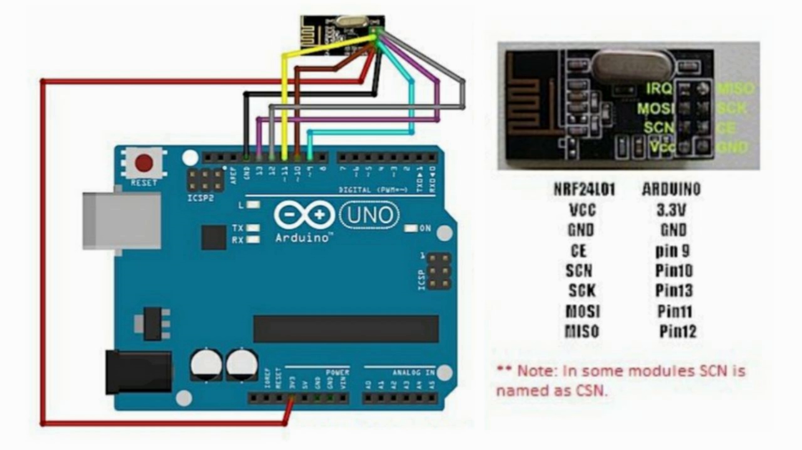
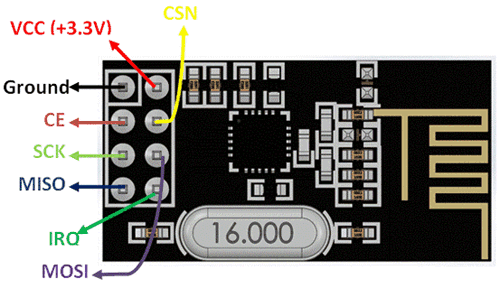

# NRF24L01 with Arduino: Bluetooth Jammer

This repository is a fork of an existing NRF24L01 project and is used for experimenting with wireless behavior in the 2.4 GHz band using Arduino-compatible boards. It documents wiring, setup, and example code based on the original implementation.

The focus of this fork is **personal experimentation and learning**, without changing the original hardware scope or core logic.

## Overview

The NRF24L01 is a 2.4 GHz wireless transceiver commonly used with microcontrollers.  
This project explores how the module can be configured to transmit across multiple channels in the Bluetooth frequency range, including Bluetooth advertising channels (37, 38, 39).

The implementation is kept close to the original project for study and testing purposes.

## Wiring

Basic wiring between the NRF24L01 module and an Arduino UNO / Nano:

| NRF24L01 Pin | Arduino Pin |
|--------------|-------------|
| VCC          | 3.3V        |
| GND          | GND         |
| CE           | D9          |
| CSN          | D10         |
| SCK          | D13         |
| MOSI         | D11         |
| MISO         | D12         |

**Important:**  
The NRF24L01 must be powered at **3.3 V only**. Supplying 5 V can permanently damage the module.

### Wiring Reference

#### Arduino + NRF24L01 wiring diagrams

#### NRF24L01 pinout reference

## Getting Started

### Hardware

- Arduino UNO or compatible board  
- NRF24L01 module  
- Breadboard and jumper wires  
- 10 µF capacitor (recommended for power stability)

### Software

- Arduino IDE  
- RF24 library by TMRh20

### Setup

1. Wire the NRF24L01 to the Arduino as shown above.
2. Install the RF24 library:
   - Arduino IDE → Sketch → Include Library → Manage Libraries
   - Search for **RF24** and install the TMRh20 version.
3. Upload the example sketch to the board.

## Notes & Troubleshooting

- **Module not detected:**  
  Add a 10 µF capacitor between VCC and GND close to the NRF24L01.
- **Unstable behavior or short range:**  
  Check power stability and antenna orientation.

## Credits

This repository is based on an existing open-source project.  
Original implementation and ideas are credited to the original author.

## Disclaimer

This project is intended for **educational and experimental purposes only**.  
Users are responsible for understanding and complying with local laws and regulations related to wireless communication.
